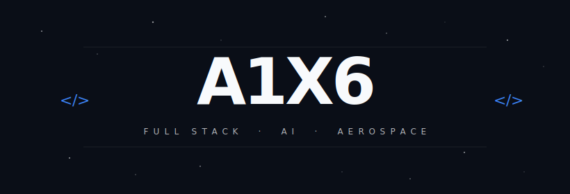
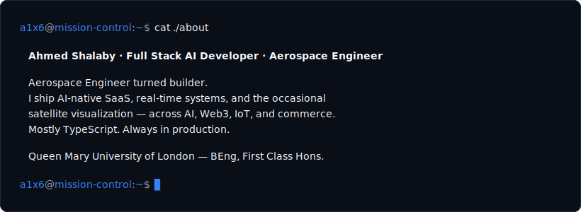
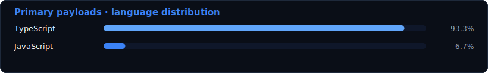

Ahmed Shalaby — Full Stack AI Developer · Aerospace Engineer 
open to roles and freelance

  

## about

## stack

## what i build

- **AI-native SaaS** — multi-LLM chat aggregators, RAG pipelines, token-billed consumer apps, agentic planning systems, voice agents
- **Real-time & IoT** — MQTT → Postgres bridges, multi-tenant sensor dashboards, live socket apps
- **Web3 & DeFi** — arbitrage bots, Solana trading infra, smart-contract development
- **3D & visualization** — Three.js scenes, orbital / satellite viz, WebGL interactive portfolios
- **Developer tooling** — npm-published CLI scaffolds, starters, internal DX tools
- **Automation & agents** — Discord / WhatsApp bots, scraping pipelines, data enrichment jobs

## telemetry

<table align="center" width="100%" border="0" cellspacing="0" cellpadding="4">
<tr>
<td align="center" colspan="2">

</td>
</tr>
<tr>
<td align="center" colspan="2">

</td>
</tr>
<tr>
<td align="center" colspan="2">

</td>
</tr>
<tr>
<td align="center" colspan="2">

</td>
</tr>
</table>

## now

- **Building** — AI-native SaaS, agentic tooling, voice AI widgets
- **Exploring** — durable workflow execution, edge-runtime agents, whatever is new on the stack
- **Open to** — ambitious product teams, high-leverage freelance, serious collaborators

---

<i>"Nothing is hard — only undiscovered."</i> 
<i>"Know more than you're supposed to — and you will know exactly what you are supposed to."</i> 
<i>per aspera ad astra</i>

